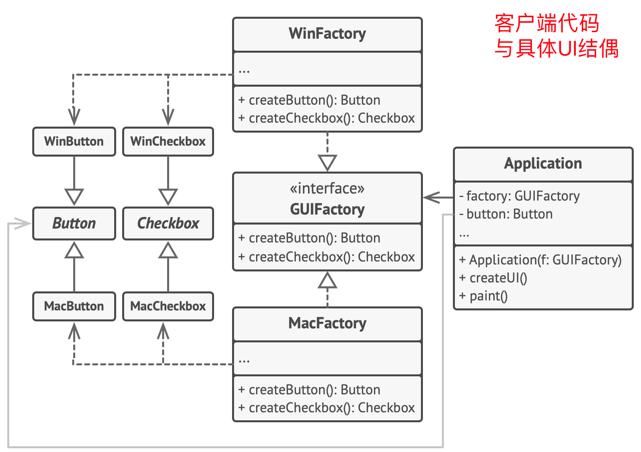

# DesignModule

## AbstractFactory
> 良好的程序中，每个类仅负责一个事情。如果一个类与多中类型产品交互，可将工厂方法抽取到独立的工厂类或具备完整功能的抽象工厂类中。
> 单一职责原则（）、开闭原则（无需修改客户端代码）
1. 抽象产品（Abstract Product）：构成系列产品的一组不同但相关的产品声明借口
2. 具体产品（Concrete Product）：1的多种不同类型实现，所有变体都必须实现相应的抽象产品
3. 抽象工厂（Abstract Factory）：接口声明了一组创建各种抽象产品的方法
4. 具体工厂（Concrete Factory）：实现3的构建方法，每个具体工厂都对应指定产品变体，且仅创建此产品变体。
### 跨平台UI类示例，跨平台中相同UI功能类似：
