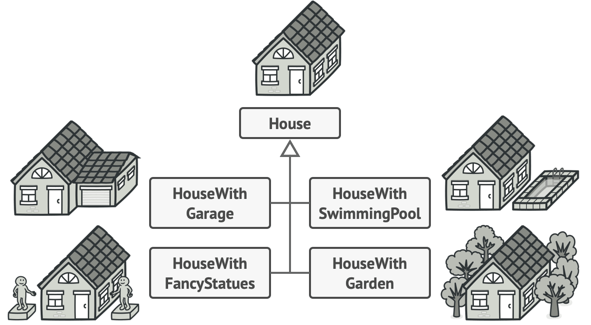
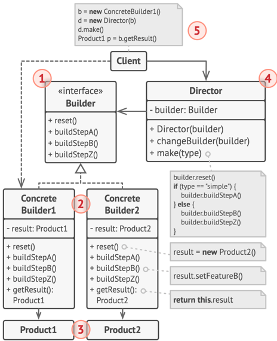

# DesignModule

## AbstractFactory：工厂模式
> 在代码需要与多个不同系列的相关产品交互（不同操作系统的UI设计） 抽象工厂提供了接口，可用于创建每个系列产品的对象。
> 良好的程序中，每个类仅负责一个事情。如果一个类与多中类型产品交互，可将工厂方法抽取到独立的工厂类或具备完整功能的抽象工厂类中。
> 单一职责原则（将复杂构造代码从产品业务逻辑分离出来）、开闭原则（无需修改客户端代码）
1. 抽象产品（Abstract Product）：构成系列产品的一组不同但相关的产品声明借口
2. 具体产品（Concrete Product）：1的多种不同类型实现，所有变体都必须实现相应的抽象产品
3. 抽象工厂（Abstract Factory）：接口声明了一组创建各种抽象产品的方法
4. 具体工厂（Concrete Factory）：实现3的构建方法，每个具体工厂都对应指定产品变体，且仅创建此产品变体。
### 跨平台UI类示例，跨平台中相同UI功能类似：

## Builder:建造者/生成器 模式
> 创建型设计模式，分步骤创建复杂对象：使用相同的创建代码生成不同类型对象，生成不同形式的产品时，可以复用相同的制造代码
> 单一职责原则（将复杂构造代码从产品业务逻辑分离出来）
> 生成器方法通常支持方法链：`someBuilder.setValueA(1).setValueB(2).create()`
### 构建的House(复杂对象)：

### 生成器模式，将对象构造代码抽离出来：

1. 生成器（Builder）：接口声明在所有类型生成器中 通用的产品 构造步骤
2. 具体生成器（Concrete Builders）：提供构造过程的不同实现
3. 产品（Products）：最终生成的对象，不同生成器构造的产品无需属于同一类层次结构或接口
4. 主管（Director）：类定义调用构造步骤的顺序，用于创建和复用特定的产品配置
5. 客户端（Client）：将某个生成器对象和主管类关联。
### 生成器模式结构

###与其他模式关系：
- 设计工作初期使用工厂方法模式，随后烟花使用抽象工厂模式、圆形模式或生成器模式。
- 生成器重点关注：如何分布生成复杂对象；抽象工厂：专门用于生产一系列相关对象。抽象工厂会马上返回产品，生成器则允许在获取产品前执行一些额外构造步骤。
- 创建复杂组合模式树时使用生成器，构造步骤以递归方式运行
- 结合使用生成器和桥接模式：主管类负责抽象工作，不同的生成器负责实现工作